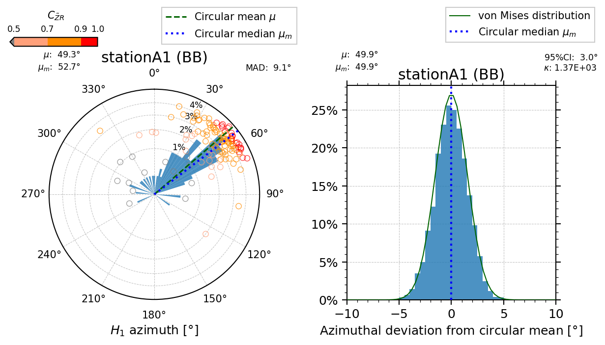

# AzimPy
Estimate horizontal orientation of ocean-bottom seismograph


[](https://opensource.org/licenses/MIT)
[](https://zenodo.org/badge/latestdoi/521535371)

Copyright (c) 2022 Yasunori Sawaki[](https://orcid.org/0000-0002-4043-3391) All rights reserved.

[`AzimPy`](https://github.com/yasuit21/AzimPy) is an open-source Python package for estimating the horizontal orientation of ocean-bottom seismographs. 
This package performs the Rayleigh-wave polarization method (e.g., Stachnik+ 2012; Doran & Laske 2017). 
One of the main classes `OrientOBS`, inherited from [`obspy.clients.fdsn.Client`](https://docs.obspy.org/packages/autogen/obspy.clients.fdsn.client.Client.html),  searches an earthquake catalog for teleseismic events as a web client and computes Rayleigh-wave polarizations for each event–station pair. 
This package also provides other classes (e.g., `OrientSingle`, `OrientAnalysis`) and functions for statistical analysis of circular data and plotting the estimated azimuths with uncertainties.

## Terms of use
- Cite an article below (Sawaki et al., in press) and a Zenodo DOI for the specific version of `AzimPy` when you publish your reseach or make a presentation. The DOI representing the specific version is probably found through [the Zenodo page for the latest version](https://doi.org/10.5281/zenodo.6972713).
- This package is under development, so any bug reports and suggestions are welcome! 

#### Use cases
- Sawaki, Y., Yamashita, Y., Ohyanagi, S., Garcia, E.S.M., Ito, A., Sugioka, H., Takahashi, T., Shinohara, M., & Ito, Y., Seafloor Depth Controls Seismograph Orientation Uncertainty, *Geophys. J. Int.*, in press, https://doi.org/10.1093/gji/ggac397

## How to install

### [Recommended] Install `AzimPy` from `PyPI` in a new `conda` environment 

```
$ conda create -n azimpy-test python=3.9 jupyter astropy "matplotlib>=3.5" "scipy>=1.4" pandas numpy tqdm
$ conda activate azimpy-test
(azimpy-test) $ conda install -c conda-forge "obspy>=1.3" 
(azimpy-test) $ python -m pip install AzimPy
```

- [Alternative] `pip install` locally in the environment 

```
$ conda create -n azimpy-test python=3.9 jupyter
$ conda activate azimpy-test
(azimpy-test) $ git clone -b v0.2.0 https://github.com/yasuit21/AzimPy.git
(azimpy-test) $ cd AzimPy
(azimpy-test) $ python -m pip install .
```

### Optional installation : [`rpy2`](https://rpy2.github.io/)

#### Installation of `R`

```
(azimpy-test) $ conda install r-essentials r-base r-circular
```
Note that this installation will take time.

Then, set environent variables.
```
export R_HOME=/path/to/envs/azimpy-test/lib/R
export R_USER=/path/to/envs/azimpy-test/lib/python3.9/site-packages/rpy2
```

#### Installation of `rpy2` in `PyPI`
```
(azimpy-test) $ python -m pip install rpy2
(azimpy-test) $ python -c "import azimpy"
```
If no warning or error is returned, the installation has been completed.


## Usage

### Compute Rayleigh-wave polarization

```python
import obspy as ob
from azimpy import OrientOBS

## Initialize web client
obs = OrientOBS(base_url='USGS', timezone=9)

## Query earthquake event catalog
obs.query_events(
    starttime=ob.UTCDateTime('20200401000000'),
    endtime=ob.UTCDateTime('20201001000000'),
    minmagnitude=6.0,
    maxdepth=100,
    orderby='time-asc',
)

## Compute Rayleigh-wave polarization for each event
## Raw SAC data should be located in '/path/to/datadir'
obs.find_stream(
    '/path/to/datadir',
    output_path='/path/to/output/stationA1',
    polezero_fpath='/path/to/polezero/hoge.paz',
    fileformat=f'*.*.%y%m%d%H%M.sac',
    freqmin=1./40, freqmax=1./20,
    max_workers=4,
    vel_surface=4.0,
    time_before_arrival=-20.0,
    time_after_arrival=600.0,
    distmin=5., distmax=120.,
)
```

Then, the output dataframe will be pickled as `stationA1_020_040.pickle` under `/path/to/output/stationA1` directory. The pickled dataframe can be loaded by `pd.read_pickle()`.

### Perform circular statistics and make a plot

#### Single station

The example uses a single station `stationA1`.

```python
import pandas as pd
from azimpy import OrientSingle, read_chtbl

## Init params
min_CC = 0.5
alpha_CI = 0.05  ## 100(1-a)% CI
bootstrap_iteration = 5000

## The output dataframe of orientations
df_orient = pd.read_pickle(
    '/path/to/output/stationA1/stationA1_020_040.pickle'
)

## Init OrientSingle for circular statistics
orientsingle_raw = OrientSingle(
    df_orient, 'stationA1', 
    if_selection=False,  # w/o bootstrap analysis
    min_CC=min_CC, weight_CC=True,
)
orientsingle_boot = OrientSingle(
    df_orient, 'stationA1', 
    if_selection=True,  # perform bootstrap analysis
    min_CC=min_CC, weight_CC=True, K=5.0,
    bootstrap_iteration=bootstrap_iteration, alpha_CI=alpha_CI
)

## Init a figure with subfigures
fig = plt.figure(figsize=[8,4])
subfigs = fig.subfigures(nrows=1, ncols=2).flatten()

## Plot for `orientsingle_raw`
orientsingle_raw.plot(
    polar=True, 
    fig=subfigs[0], in_parentheses='BB',
    add_cbar=True
)
subfigs[0].legend(loc=1, bbox_to_anchor=(1,1.15), fontsize='small')

## Plot for `orientsingle_boot`
orientsingle_boot.plot(
    fig=subfigs[1], in_parentheses='BB',
)
subfigs[1].legend(loc=1, bbox_to_anchor=(1,1.15), fontsize='small')

## Show or save the figure
fig.savefig()
plt.show()
```


#### Multiple stations
The example uses multiple stations whose names are `stationAX`.

```python
from azimpy import OrientAnalysis

stationList = ['stationA1','stationA2','stationA3','stationA4']

## Channeltable including above stations' info
df_chtbl = read_chtbl('/path/to/channeltable.txt')
df_chtbl = df_chtbl.query('comp.str.endswith("U")')

## Init OrientAnalysis for circular statistics
oa_raw = OrientAnalysis(
    if_selection=False,  # w/o bootstrap analysis
    df_chtbl=df_chtbl, 
    min_CC=min_CC, 
)
oa_boot = OrientAnalysis(
    if_selection=True,  # perform bootstrap analysis
    df_chtbl=df_chtbl, 
    min_CC=min_CC, alpha_CI=alpha_CI, 
    bootstrap_iteration=bootstrap_iteration, 
)

for stationName in stationList:
    period = df_chtbl.at[stationName,'period']
    df_orient = pd.read_pickle(
        f'/path/to/output/{stationName}/{stationName}_020_040.pickle'
    )
    ## Add the dataframe in `oa_raw`
    ## This is actually passed to `OrientSingle`
    oa_raw.add_station(
        df_orient, stationName, 
        period=period
    )
    ## Add the dataframe in `oa_boot`
    oa_boot.add_station(
        df_orient, stationName, 
        period=period
    )
```

- Plot the results using `matplotlib.pyplot`
    - Original results w/o bootstrap resampling
    ```python
    fig = oa_raw.plot()
    ```
    - Results of bootstrap analysis
    ```python
    fig = oa_boot.plot()
    ```


## Note
- `SAC` format is only supported, but you may use some other formats.
- The observed data files must be located in one directory, where `OrientOBS.find_stream()` will try to search for necessary input files. No waveform data in websites and repository are available in this package at this moment.
- The author has tested this package in `Linux` environments (`CentOS 7` and `WSL Ubuntu 20.04`), so it might be incompatible when installed in `Windows`.
- `rpy2` is an optional wrapper to run [`circular`](https://www.rdocumentation.org/packages/circular) in `R` language, which performs the Kuiper test.


### References
- Sawaki, Y., Yamashita, Y., Ohyanagi, S., Garcia, E.S.M., Ito, A., Sugioka, H., Takahashi, T., Shinohara, M., & Ito, Y., Seafloor Depth Controls Seismograph Orientation Uncertainty, *Geophys. J. Int.*, in press, https://doi.org/10.1093/gji/ggac397
- Stachnik, J.C., Sheehan, A.F., Zietlow, D.W., et al., 2012, Determination of New Zealand ocean bottom seismometer orientation via Rayleigh-wave polarization. *Seismol. Res. Lett.*, 83, 704–713. https://doi.org/10.1785/0220110128 
- Doran, A.K. & Laske, G., 2017, Ocean‐bottom deismometer instrument orientations via automated Rayleigh‐wave arrival‐angle measurements. *Bull. Seismol. Soc. Am.*, 107, 691–708. https://doi.org/10.1785/0120160165 
- Takagi, R., Uchida, N., Nakayama, T., et al., 2019, Estimation of the orientations of the S‐net cabled ocean‐bottom sensors. *Seismol. Res. Lett.*, 90, 2175–2187. https://doi.org/10.1785/0220190093
- [Concept DOI for the latest `AzimPy`: `10.5281/zenodo.6972713`](https://doi.org/10.5281/zenodo.6972713)
    
## Acknowledgments

This package makes use of [`ObsPy v1.3.0`](https://github.com/obspy/obspy) for [FDSN web client services](https://www.fdsn.org/webservices/) and processing seismograms.


## License

This project is licensed under the MIT License, see the `LICENSE` for details.